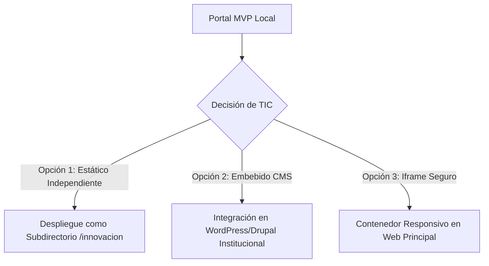

# Dossier de Presentación Técnica: Portal de Innovación y Desarrollo
**Hospital Dr. Gustavo Fricke | Unidad de Innovación y Desarrollo**

Este documento detalla las especificaciones técnicas, decisiones de arquitectura y planes de integración del MVP del portal de la **Unidad de Innovación y Desarrollo**. Está diseñado para facilitar el análisis, validación e integración por parte del **Departamento de TIC (Sistemas/Informática)** del hospital.

---

## 1. Resumen Ejecutivo del Portal

El portal de la Unidad de Innovación y Desarrollo tiene como objetivo centralizar la relación de la unidad con el personal clínico/administrativo (intraemprendimiento), investigadores y la red de startups tecnológicas externas (HealthTech). 

### Objetivos del Portal:
1. **Ordenar la Demanda**: Evitar la dispersión de ideas o propuestas no estructuradas mediante formularios dinámicos guiados.
2. **Promover Desafíos Clínicos**: Publicar necesidades operacionales y clínicas prioritarias del hospital de forma clara para recibir propuestas pertinentes.
3. **Visibilizar el Impacto**: Mostrar un portafolio vivo de los proyectos en curso, sus fases y métricas de avance referenciales.
4. **Facilitar la Documentación**: Proveer acceso directo a documentos estándar requeridos para pilotajes, ética e investigación.

---

## 2. Arquitectura de Software y Frontend

Para asegurar la máxima compatibilidad, velocidad de despliegue y autonomía en entornos corporativos de salud, el portal se diseñó siguiendo el principio de **cero dependencias externas obligatorias**.

### Ficha Técnica:
- **Tecnologías Core**: HTML5 Semántico, CSS3 Vanilla (Grid y Flexbox local) y JavaScript Vanilla (ES6+).
- **Peso Total**: < 100 KB (altamente optimizado para la intranet o la web oficial).
- **Diseño Responsivo**: Grid fluido de doble comportamiento. Las clases son 100% compatibles con **Bootstrap 5**, pero incorporan un fallback CSS local completo en `css/styles.css`.
- **Funcionamiento Offline**: El sitio web puede ejecutarse localmente abriendo `index.html` directamente en cualquier navegador moderno (Edge, Chrome, Firefox), sin requerir conexión a internet ni llamadas a servidores externos (CDNs).

### Ventajas para TIC:
- **Sin Bloqueos de Seguridad**: No realiza llamadas externas que puedan ser bloqueadas por firewalls hospitalarios o políticas de proxy estrictas.
- **Portabilidad**: Se puede integrar en cualquier servidor web estático (IIS, Apache, Nginx) o embeberse dentro de la arquitectura de la intranet actual.
- **Fácil Migración**: La semántica limpia del HTML permite copiar y pegar bloques directamente en plantillas de CMS institucionales (WordPress, Drupal, Joomla) o frameworks corporativos (.NET, PHP, Java).

---

## 3. Rutas de Integración Propuestas

Proponemos tres escenarios para la integración del portal al ecosistema digital del hospital:

### Opción 1: Despliegue Estático Independiente (Recomendado para velocidad)
- **Método**: Copiar la estructura de carpetas (`index.html`, `css/`, `js/`, `assets/`, `docs/`) en un directorio dedicado en el servidor web institucional (ej. `https://www.hospitalfricke.cl/innovacion/`).
- **Esfuerzo estimado**: < 2 horas.

### Opción 2: Integración en el CMS Institucional
- **Método**: Utilizar los bloques HTML semánticos del portal para recrear la estructura en el editor del CMS del hospital. El archivo `css/styles.css` se puede importar como hoja de estilos personalizada para mantener la identidad visual del portal.
- **Esfuerzo estimado**: 1 a 2 días hábiles (según el CMS).

### Opción 3: Embebido mediante Iframe Responsivo
- **Método**: Si el CMS tiene restricciones de código estrictas, el MVP estático puede hostearse de forma aislada y embeberse con un iframe responsivo que controle el redimensionamiento dinámico.
- **Esfuerzo estimado**: < 3 horas.

---

## 4. Formularios, Seguridad y Tratamiento de Datos (Ley 19.628)

Un punto crítico en sistemas hospitalarios es resguardar la privacidad de la información y evitar fugas de datos sensibles de pacientes o antecedentes clínicos protegidos bajo la **Ley 19.628** (Protección de la Vida Privada / Datos Personales).

### Diseño de Seguridad en el MVP:
- **Procesamiento del Formulario en el Cliente**: El formulario de "Postular Solución" actualmente **no envía datos a ningún servidor de internet ni almacena información en bases de datos**.
- **Generación Local**: Todo el procesamiento se realiza en el navegador del usuario a través de JavaScript en `js/main.js`. El sistema genera un resumen de texto plano que el usuario puede revisar, copiar a su portapapeles o descargar como archivo `.txt` local.
- **Cero Datos Sensibles**: Se instruye activamente al usuario a **no ingresar antecedentes médicos identificables**.

### Hoja de Ruta para Integración Productiva por TIC:
Cuando TIC decida hacer el formulario 100% interactivo y productivo, sugerimos dos opciones de backend seguro:

1. **Opción Email Corporativo**:
   - Conectar el formulario a un servicio local PHP `mail()` o un servidor SMTP interno del hospital que envíe los datos directamente al buzón oficial de la unidad: `innovacion.hgf@redsalud.gob.cl`.
   - Incorporar cifrado de transporte (HTTPS) y desinfección de entradas (sanitization) para evitar inyecciones de código.
2. **Opción Base de Datos Segura**:
   - Crear una base de datos relacional sencilla (ej. MySQL/PostgreSQL bajo firewall institucional).
   - Desarrollar un endpoint REST API básico en el backend corporativo para recibir los datos de la propuesta, asignándoles un ID de trazabilidad correlativo.
   - Restringir el acceso a este panel a través del Active Directory hospitalario o roles de intranet autorizados.

---

## 5. SEO, Accesibilidad y Buenas Prácticas

El portal ha sido diseñado bajo exigentes estándares web modernos:
- **Accesibilidad (WCAG 2.1)**:
  - **Skip Link**: Enlace directo incorporado al inicio para saltar la navegación (`#contenido`), esencial para lectores de pantalla.
  - **Navegación por Teclado**: Todo elemento interactivo (botones, acordeones, inputs, pestañas de portafolio) es completamente enfocable por teclado con un indicador visual altamente visible de color rojo suave (`outline: 3px solid var(--gob-red-soft)`).
  - **Estructura Semántica**: Uso riguroso de etiquetas `<main>`, `<section>`, `<nav>`, `<header>`, `<footer>`, `<article>`, y atributos `aria-*`.
  - **Contraste de Colores**: Combinaciones de color validadas que aseguran un contraste mayor a 4.5:1 para personas con visión reducida.
- **SEO & Performance**:
  - Títulos descriptivos y meta-etiquetas de descripción específicas.
  - Cero dependencias pesadas: carga instantánea en menos de 100ms.

---

## 6. Siguientes Pasos y Checklist para TIC

Para llevar esta propuesta al entorno de producción oficial, se solicita a TIC coordinar los siguientes puntos:
- [ ] **Validación de URL / Dominio**: Definir si se usará un subdirectorio o subdominio exclusivo (ej. `innovacion.hospitalfricke.cl`).
- [ ] **Integración de Logos**: Reemplazar la marca tipográfica temporal "HGF" en el header por el archivo SVG/PNG del logo oficial del hospital en alta resolución.
- [ ] **Configuración de Endpoint del Formulario**: Definir si se conectará a un buzón SMTP corporativo o a una API de base de datos segura.
- [ ] **Alineación de Servidor Web**: Validar el soporte del servidor IIS/Apache/Nginx del hospital para servir los archivos estáticos de forma segura con cabeceras de seguridad HTTPS recomendadas.
